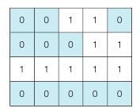

## 문제
N x M 크기의 얼음 틀이 있다. 구멍이 뚫려 있는 부분은 0, 칸막이가 존재하는 부분은 1로 표시된다.  
구멍이 뚫려 있는 부분끼리 상, 하, 좌, 우로 붙어 있는 경우 서로 연결되어 있는 것으로 간주한다.  
이때 얼음 틀의 모양이 주어졌을 때 생성되는 총 아이스크림의 개수를 구하는 프로그램을 작성하라.  

위의 예시에서는 총 아이스크림 3개가 생성된다.

## 입력
- 첫째 줄에 얼음 틀의 세로 길이 N과 가로 길이 M이 주어진다. (1 ≤ N, M ≤ 1000)
- 다음 N개의 줄에는 얼음 틀의 형태가 주어진다. 
- 이때 구멍이 뚫려있는 부분은 0, 그렇지 않은 부분은 1 이다.

## 출력
- 한 번에 만들 수 있는 아이스크림의 개수를 출력한다.

## 예제 입력
15 14  
00000111100000  
11111101111110  
11011101101110  
11011101100000  
11011111111111  
11000000011111  
01111111111111  
00000000011111  
01111111111000  
00011111111000  
00000001111000  
11111111110011  
11100011111111  
11100011111111  
 

## 예제 출력
8

